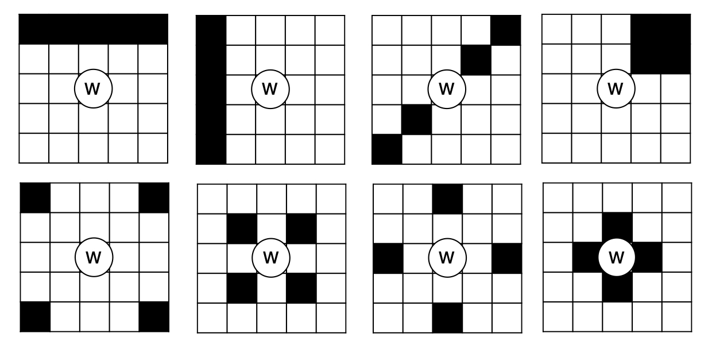

# Westworld Bingo

## Rules

It's like Bingo except you accumulate your points. Simple!

*How is your board created?* Each player chooses 20 possible squares. Each time you play, your board will be randomly generated using this list (15 from your pool and 9 from the rest will be chosen). The middle square is always free.

*How do we handle ties?* If there's a tie, the person with the most squares filled wins. Otherwise, the person who earned the most squares earliest wins.

*Which patterns are considered?* Use the 8 patterns from below:



1. Full Row
2. Full Column
3. Diagonal
4. Poststamp (four in the top right corner)
5. Outside Four Corners
6. Inside Four Corners
7. Outside Diamond
8. Inside Diamond

Each is worth 5 points.


## Creating boards.

Creates random bingo boards.

```
$ python bingo.py --seed 149

seed: 149

caleb (918878)
|   2 |  16 |  22 |  32 |  46 |
|   3 |  17 |  23 |  33 |  52 |
|  10 |  18 |  ⓦ  |  34 |  54 |
|  12 |  19 |  30 |  36 |  58 |
|  13 |  21 |  31 |  42 |  72 |

charlotte (421870)
|   0 |   8 |  21 |  33 |  52 |
|   3 |   9 |  22 |  34 |  54 |
|   4 |  10 |  ⓦ  |  35 |  56 |
|   6 |  15 |  31 |  39 |  62 |
|   7 |  17 |  32 |  47 |  64 |

dolores (908824)
|   0 |  20 |  31 |  50 |  63 |
|   1 |  21 |  32 |  59 |  64 |
|  12 |  22 |  ⓦ  |  60 |  66 |
|  17 |  23 |  40 |  61 |  70 |
|  18 |  30 |  42 |  62 |  71 |
```

Change the seed for new boards.

```
python bingo.py --seed 150

seed: 150

caleb (918878)
|   4 |  16 |  24 |  33 |  53 |
|  11 |  17 |  25 |  34 |  55 |
|  12 |  18 |  ⓦ  |  35 |  59 |
|  13 |  22 |  29 |  37 |  64 |
|  15 |  23 |  31 |  49 |  70 |

charlotte (421870)
|   0 |   7 |  21 |  32 |  56 |
|   1 |   8 |  23 |  33 |  62 |
|   2 |   9 |  ⓦ  |  34 |  68 |
|   4 |  11 |  30 |  40 |  71 |
|   6 |  15 |  31 |  44 |  74 |

dolores (908824)
|   1 |  20 |  30 |  48 |  64 |
|   2 |  21 |  32 |  51 |  69 |
|   3 |  22 |  ⓦ  |  52 |  70 |
|  17 |  23 |  34 |  60 |  72 |
|  19 |  24 |  43 |  63 |  74 |
```

Score boards by changing the chosen flag.

```
$ python bingo.py --seed 149 --chosen ./chosen/ep1.txt

seed: 149

Found:
  0. Bernard's secret revealed.
  2. Host gets repaired.
  3. There's a flashback.
  7. A character gets redemption.
 10. Dolores turn a human into a host.
 11. Dolores hacks a machine (not another host).
 12. Dolores loses conciousness.
 13. Bernard switches personalities.
 14. Bernard resentfully fights someone.
 17. Charlotte pitches a business idea.
 19. Caleb takes a gig.
 20. There's a four-legged animal (dog, elephant, horse, buffalo, etc.).
 21. Same scene plays out more than once.
 24. A human finds out another human is actually a host.
 27. A character has a fast wardrobe change.
 28. A character is seen in more than 3 outfits in one episode.
 29. Someone swims.
 30. A religious reference is made by a character (e.g. comparing hosts to higher beings).
 33. Code appears on screen.
 36. Scene from Park 3: Warworld.
 44. Francis's voice is heard.
 54. New gadget is introduced (such as the tool Ash used to prevent being tracked or the augmented reality glasses).
 55. A host drives a car or flying vehicle.
 56. A character references the special value of the Delos corporation.
 58. A host makes a joke.
 59. A human or host questions if a host is lying.
 60. Someone takes an implant (limbic sedative).
 61. There's fire.
 62. There's opera.
 63. A host talks about the "books".
 64. There's a callback to another sci-fi show: "I'm afraid I can't do that".
 65. There's a slow-mo aerial cinematic shot (a la Bladerunner).
 66. There's a scene in an elevator.
 69. There's a hologram phone call.

caleb (918878)
|   X |  16 |  22 |  32 |  46 | Found: 2
|   X |   X |  23 |   X |  52 | Found: 3 17 33
|   X |  18 |  ⓦ  |  34 |   X | Found: 10 54
|   X |   X |   X |   X |   X | Found: 12 19 30 36 58
|   X |   X |  31 |  42 |  72 | Found: 13 21

Total Found = 14
Score = 15, Patterns = ['column_1', 'inside_four_corners', 'row_4']

charlotte (421870)
|   X |   8 |   X |   X |  52 | Found: 0 21 33
|   X |   9 |  22 |  34 |   X | Found: 3 54
|   4 |   X |  ⓦ  |  35 |   X | Found: 10 56
|   6 |  15 |  31 |  39 |   X | Found: 62
|   X |   X |  32 |  47 |   X | Found: 7 17 64

Total Found = 11
Score = 0, You got lost in the maze!

dolores (908824)
|   X |   X |  31 |  50 |   X | Found: 0 20 63
|   1 |   X |  32 |   X |   X | Found: 21 59 64
|   X |  22 |  ⓦ  |   X |   X | Found: 12 60 66
|   X |  23 |  40 |   X |  70 | Found: 17 61
|  18 |   X |  42 |   X |  71 | Found: 30 62

Total Found = 14
Score = 0, You got lost in the maze!
```
